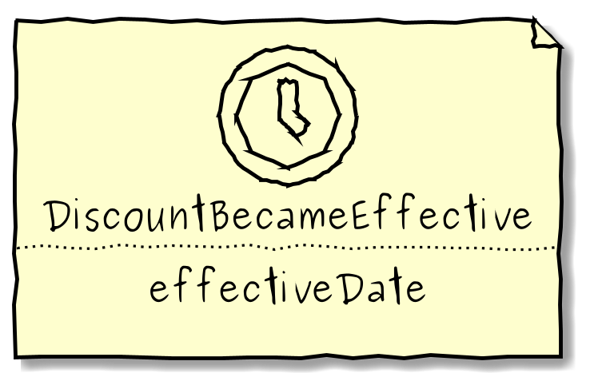
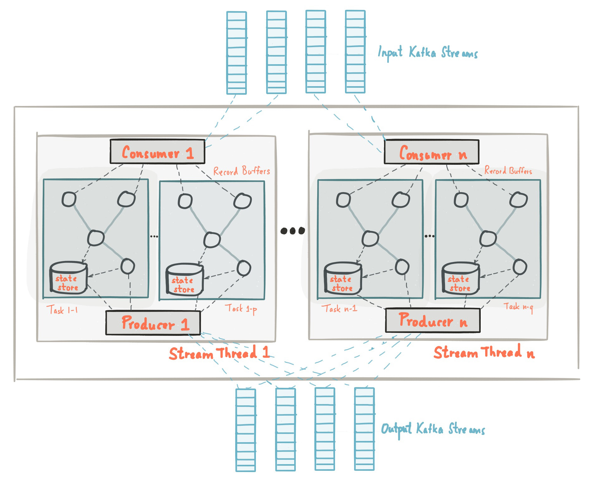

# Time-based events

## On Kafka

---
@snap[north span-100 headline]
### Context
@snapend


---
@snap[north span-100 headline]
### 1. Use case - Schedule
@snapend

On __joiningDate__ plus 6 months, **Discount** becomes effective and **DiscountAccount** should be created.

---
@snap[north span-100 headline]
### Concern - mindset
@snapend

@snap[midpoint span-70]
How to schedule an event?    


Aren't events about the past?
@snapend

@snap[south span-30]

@snapend

---
@snap[north span-100 headline]
### Concern - architecture
@snapend


---
@snap[north-west bio-name] 
### Konrad Jakubiec
@snapend

@snap[west text-08 span-80] 


Open-minded Software Engineer **@VirtusLab**.<br/>


Passionate about Domain-driven Design, Reactive Microservices and Event-driven architecture.<br/>


Spending free time on self-growth, discovering new music and playing on drums.

@snapend

@snap[north-east span-20]

@snapend

@snap[south-west template-note text-gray] 
<kjakubiec@virtuslab.com>
@snapend


---
@snap[north span-100 headline]
### Agenda
@snapend

@ol

- Theoretical background
- Use Case
- Solution 
- Summary

@olend
---
@snap[north span-100 headline]
### Domain events
@snapend


---
@snap[north span-100 headline]
### Aggregate events
@snapend


---
@snap[north span-100 headline]
### Subscribers
@snapend


---
@snap[north span-100 headline]
### Time-based events
@snapend

### A niche

---
@snap[north span-100 headline]
### Retroactive event
@snapend


---
@snap[north span-100 headline]
### A niche
@snapend

@fa[quote-left](...expiring time frame will generally have a descriptive name that will become part of the Ubiquitous Language...)

+++
@snap[north span-100 headline]
### A niche
@snapend
@fa[quote-left](Therefore, you have a name for that particular time-based Domain Event.)

---
@snap[north span-100 headline]
### Time-based events
@snapend


---
@snap[north span-100 headline]
### Time-based events - Context
@snapend


---
@snap[north span-100 headline]
### Concern - mindset
@snapend

@snap[midpoint span-70]
What about aggregates?
@snapend

@snap[south span-30]

@snapend
---
@snap[north span-100 headline]
### Time-based events - Aggregate
@snapend


---
@snap[north span-100 headline]
### A niche
@snapend
@fa[quote-left](Schedulers and Timers are also very interesting types of events, but they are a often times an implementation-level consideration.)

---
@snap[north span-100 headline]
### 2. Concern - architecture
@snapend


---
@snap[north span-100 headline]
### Kafka Streams Topology
@snapend

@snap[midpoint span-55]

@snapend

---
@snap[north span-100 headline]
### Kafka Streams DSL
@snapend

```
KTable<EmployeeId, Employee> employee = new KStreamBuilder()
    .stream("employee-events")
    .groupBy((employeeId, event) -> event.employeeId(), ...)
    .aggregate(..., "employee_store");

```

---
@snap[north span-100 headline]
### 3. Concern - how to schedule on Kafka?
@snapend


---
@snap[north span-100 headline]
### PAPI
@snapend

Kafka Streams Processor API


```
/** 
 * A processor of key-value pair records.
 *
 * @param <K> the type of keys
 * @param <V> the type of values
 */
@InterfaceStability.Evolving
public interface Processor<K, V> {

    /**
     * Initialize this processor with the given context. The framework ensures this is called once per processor when the topology
     * that contains it is initialized. When the framework is done with the processor, {@link #close()} will be called on it; the
     * framework may later re-use the processor by calling {@code #init()} again.
     * <p>
     * The provided {@link ProcessorContext context} can be used to access topology and record meta data, to
     * {@link ProcessorContext#schedule(Duration, PunctuationType, Punctuator) schedule} a method to be
     * {@link Punctuator#punctuate(long) called periodically} and to access attached {@link StateStore}s.
     * 
     * @param context the context; may not be null
     */
    void init(ProcessorContext context);

    /**
     * Process the record with the given key and value.
     *
     * @param key the key for the record
     * @param value the value for the record
     */
    void process(K key, V value);

    /**
     * Close this processor and clean up any resources. Be aware that {@code #close()} is called after an internal cleanup.
     * Thus, it is not possible to write anything to Kafka as underlying clients are already closed. The framework may
     * later re-use this processor by calling {@code #init()} on it again.
     * <p>
     * Note: Do not close any streams managed resources, like {@link StateStore}s here, as they are managed by the library.
     */
    void close();
}
```

---
@snap[north span-100 headline]
### Schedule!
@snapend

```
  context.schedule(scheduleDuration, PunctuationType.WALL_CLOCK_TIME) { ... }
```

---
@snap[north span-100 headline]
### The idea
@snapend

@ol

- Use **StateStore** to store not effective events
- Schedule **Punctuation** to poll for effective events from **StateStore**
- Forward all effective events

@olend

---
@snap[north span-100 headline]
### Does it work?
@snapend

Show me the code!

---
@snap[north span-100 headline]
### Schedule topology
@snapend


---
@snap[north span-100 headline]
### Summary
@snapend

#### Pros

@ol

- No additional technology to support time-based events
- Out of the box scalability based on Kafka partitioning  
- Fault tolerance thanks to StateStores and Topic replication
- Encapsulation of processing per aggregate

@olend

---
@snap[north span-100 headline]
### Summary
@snapend

#### Cons

@ol

- Is it really suitable solution for scheduling?
- Increased memory usage due to RocksDB - aka State Stores
- At least one delivery - need for either deduplication or idempotency
- Based on low-level processor API

@olend

---
@snap[north span-100 headline]
### 2. Use case - Reschedule
@snapend

Whenever **Employee** changes department, **Discount** should become effective on moving date + 6 months.

---
@snap[north span-100 headline]
### 3. Use case - Cancel
@snapend

Whenever **Employee** leaves, **Discount** should never become effective.

---
@snap[north span-100 headline]
### What?!
@snapend

## ?
---
@snap[north span-100 headline]
### Thank you!
@snapend

## Questions ????

---